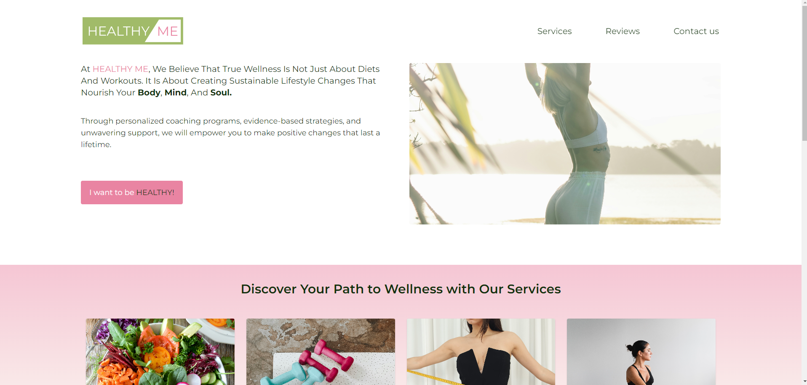
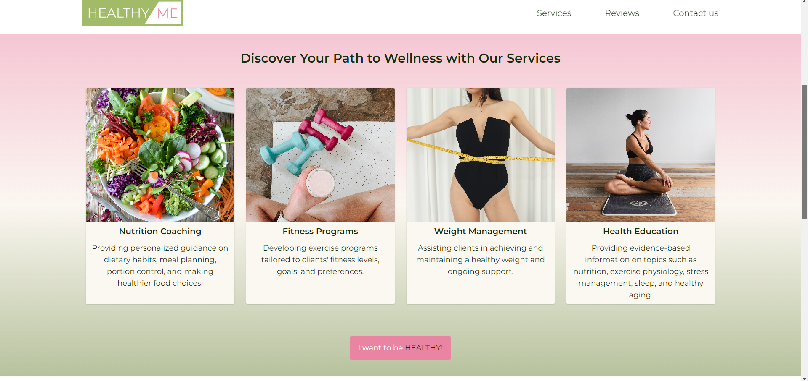
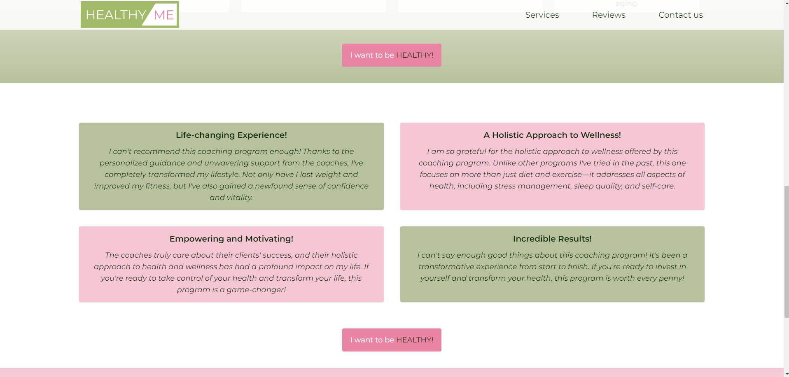

# Healthy Me Website

## Description

This project is dedicated for creating a user-friendly and informative website for promoting health coaching services and empowering individuals to lead healthier lives.
This website serves as a comprehensive platform for individuals seeking guidance, support, and educative resources to improve their overall well-being.
The website's design includes 4 sections:

- Hero section - where are presented the key goals the coach is reaching for in the "Healthy Me" plan;
- Services - a section where the 4 main provided services are presented with representative images and their descriptions;
- Reviews - a section for clients' testimonials;
- Contact us - a form the user should complete to get in touch with the coach.

## Future implementations and updates

- FAQ section for clarifying other important details about the Healthy Me plan;
- Educational Resources Page, where will be posted informative articles, blog posts, and resources on nutrition, fitness, stress management, and other health-related topics;
- Community Support, where all users will have the opportunity to share experiences, and support each other.

## Installation Instructions

Run in the terminal

##### npm install

##### npm run dev

## Demo

#### Hero Section

#### Services Section

#### Reviews Section

## Acknowledgements

Following resources were used in designing and developing the website:

- Figma;
- ReactJS + Vite;
- tailwindCSS.
